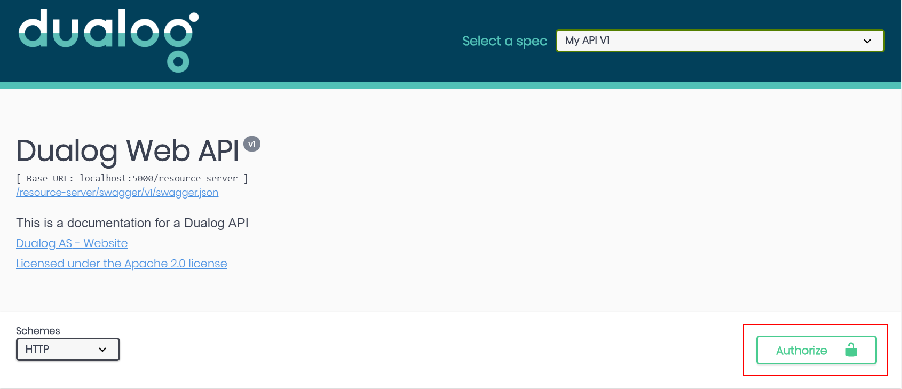
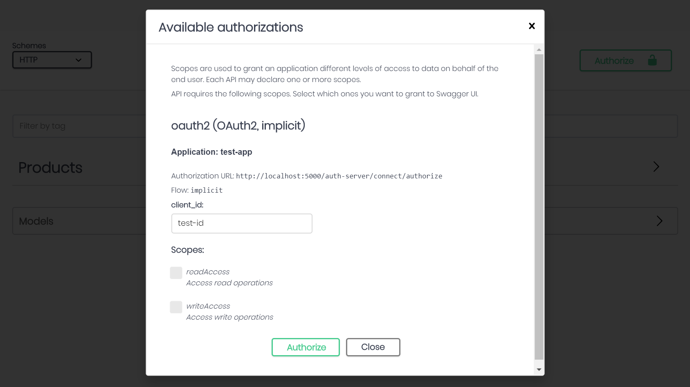
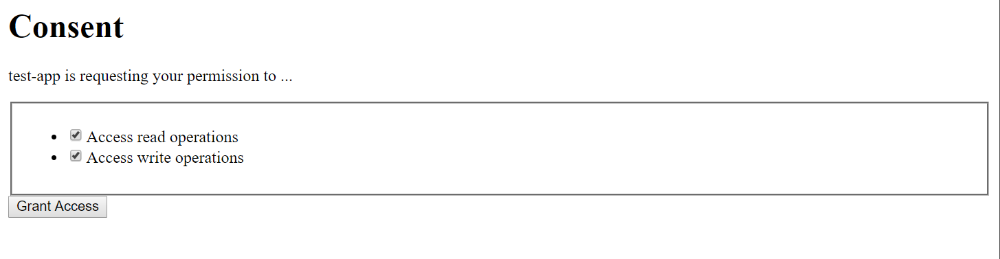

# Dualog Swagger UI

Swagger UI for public API's that follows the marketing requirements of Dualog.

>[Swagger](http://swagger.io/) tooling for API's built with ASP.NET Core. Generate beautiful API documentation, including a UI to explore and test operations, directly from your routes, controllers and models. Once you have an API that can describe itself in Swagger, you've opened the treasure chest of Swagger-based tools including a client generator that can be targeted to a wide range of popular platforms. See [swagger-codegen](https://github.com/swagger-api/swagger-codegen) for more details.

## Getting started

First restore the NuGet packages:

```bash
dotnet restore
```

Then run the project locally:

```bash
dotnet run
```

A browser should open at `http://localhost:5000/resource-server/swagger/index.html`,
the program is also running an Identity server located at `http://localhost:5000/auth-server/`

### __Using the OAuth2 Flow__

Press authenticate



Then selected the wanted scopes for your session



Then press `Authorize`, this will redirect you to a really bad login page, with the username and password already provided for you.

The next step is to consent to the API scopes asked for



When `Grant Access` is pressed you will be redirected to the API again, now you can start using the APIs.

### __Takeaways__

Files to take notice to:

* DualogSetup.cs
* Resources/index.html
* wwwroot/swagger-ui/dualog-logo.png
* wwwroot/swagger-ui/dualog-swagger.css

To server the index.html as a static file remember to include it as an `Embedded Resource` in the build configuration.

```xml
 <ItemGroup>
    <None Remove="Resources\index.html" />
  </ItemGroup>

  <ItemGroup>
    <EmbeddedResource Include="Resources\index.html" />
  </ItemGroup>
```

Then you will be able to server the index.html from a stream

```csharp
  ...
  // Add the custom index.html page (has to be an embedded resource)
  options.IndexStream = () => Assembly.GetExecutingAssembly().GetManifestResourceStream("SwaggerUI.Resources.index.html");
``` 

Also remember to use the ASP.NET Core StaticFiles middleware to serve the file

```csharp
  ...
  // IMPORTANT: to be able to serve the custom index html
  resourceServer.UseStaticFiles();
```

To inject a custom css file to the swagger simply apply this to the SwaggerUI middleware:

```csharp
  ...
  // Set our custom css (placed in wwwroot/swagger-ui/)
  options.InjectStylesheet("/resource-server/swagger-ui/dualog-swagger.css");
```

### __Generating a static JSON file (CLI)__

__NOTE: This feature is in beta still, might not work__

The Swashbuckle CLI tool can retrieve Swagger JSON directly from the application startup assembly, and write it to file. This is useful if you want to incorporate Swagger generation into a CI/CD process, or if you want to serve it from static file at run-time.

The tool is installed as a [per-project, framework-dependent CLI extension](https://docs.microsoft.com/en-us/dotnet/core/tools/extensibility#per-project-based-extensibility) inside the SwaggerUI.csproj:

```xml
<ItemGroup>
  <DotNetCliToolReference Include="Swashbuckle.AspNetCore.Cli" Version="3.0.0-beta1" />
</ItemGroup>
```

To see available commands, run the following command from the project root:

```bash
dotnet swagger tofile --help
```

To generate a JSON file from command line, run:

```bash
dotnet swagger tofile --output wwwroot\api-docs\v1\swagger.json .\bin\Debug\netcoreapp2.1\SwaggerUI.dll v1
````

This can  also be run as a MSBuild Exec command to generate Swagger JSON at build-time within the SwaggerUI.csproj file:

```xml  
 <Target Name="SwaggerToFile" AfterTargets="AfterBuild">
    <Exec Command="dotnet swagger tofile --output wwwroot\api-docs\v1\swagger.json $(OutputPath)$(AssemblyName).Views.dll v1" />
  </Target>
```
